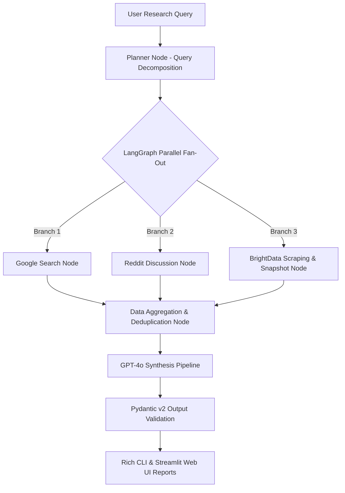

# Advanced AI Web Agent for Multi-Source Research

[](https://www.python.org/)
[](https://github.com/langchain-ai/langgraph)
[](https://www.langchain.com/)
[](https://docs.pydantic.dev/)
[](https://streamlit.io/)

> An enterprise-grade, multi-source AI research agent built using **LangGraph**, **LangChain**, **GPT-4o**, **Pydantic v2**, **BrightData Web Unlocker API**, **Google Search**, and **Reddit API**.
> The agent executes parallel research workflows across web search, social discussions, and deep web page scraping, synthesizing structured empirical research reports with verified source citations.

---

## 🎯 Alignment with Profile Specification

- **LangGraph Parallel Workflows**: Developed a `StateGraph` architecture featuring parallel fan-out nodes (`google_node`, `reddit_node`, `scraping_node`) and fan-in aggregation (`aggregate_node` -> `synthesis_node`).
- **GPT-4o & Pydantic Analysis Pipeline**: Implemented an end-to-end analysis pipeline using GPT-4o with `with_structured_output`, enforcing strong schema validation via Pydantic v2 data models (`ResearchReport`, `SourceCitation`, `KeyFinding`, `SentimentOverview`).
- **LangChain Integration**: Built modular `ChatPromptTemplate` structures for dynamic query decomposition and multi-source cross-platform synthesis.
- **BrightData Scraping & Snapshot Management**: Engineered real-time web page scraping using BrightData API combined with a local `SnapshotManager` for HTML-to-Markdown conversion, timestamping, and snapshot caching.

---

## 🏗️ System Architecture



---

## 🚀 Quick Start & Installation

### 1. Clone & Navigate to Project Workspace
```bash
cd /Users/diveshogha/.gemini/antigravity/scratch/multi-source-research-agent
```

### 2. Install Dependencies
```bash
pip install -r requirements.txt
```

### 3. Environment Configuration
Copy `.env.example` to `.env` and fill in your API keys (optional — automatic mock engines run out-of-the-box if keys are omitted):
```bash
cp .env.example .env
```

---

## 💻 Running the Application

### Option A: Interactive Rich CLI
Run multi-source research directly from your terminal with real-time execution spinners and formatted tables:
```bash
python main.py --query "Compare DeepSeek-R1 and GPT-4o for tool use and agentic coding"
```

### Option B: Streamlit Web Dashboard
Launch the interactive web interface:
```bash
streamlit run app.py
```

---

## 🧪 Running Automated Tests
Run unit and integration tests using Pytest:
```bash
pytest tests/ -v
```

---

## 📁 Repository Structure

```
multi-source-research-agent/
├── agent/
│   ├── graph.py             # Compiled LangGraph StateGraph topology
│   └── nodes.py             # Execution logic for parallel and synthesis nodes
├── schemas/
│   ├── research_state.py    # AgentState TypedDict for graph state propagation
│   └── output_models.py     # Pydantic v2 structured output schemas
├── tools/
│   ├── google_search.py     # Google Search (SerpAPI / Tavily / DDG fallback)
│   ├── reddit_search.py     # Reddit API (PRAW / JSON endpoints / mock fallback)
│   └── brightdata_scraper.py # BrightData API + SnapshotManager engine
├── prompts/
│   └── templates.py         # Modular LangChain ChatPromptTemplates
├── config.py                # Environment and settings configuration
├── main.py                  # Rich CLI terminal entrypoint
├── app.py                   # Streamlit Web UI dashboard
├── tests/
│   └── test_agent.py        # Automated test suite
├── requirements.txt         # Pinned project dependencies
├── .env.example             # Environment variables template
└── README.md                # Project documentation
```
